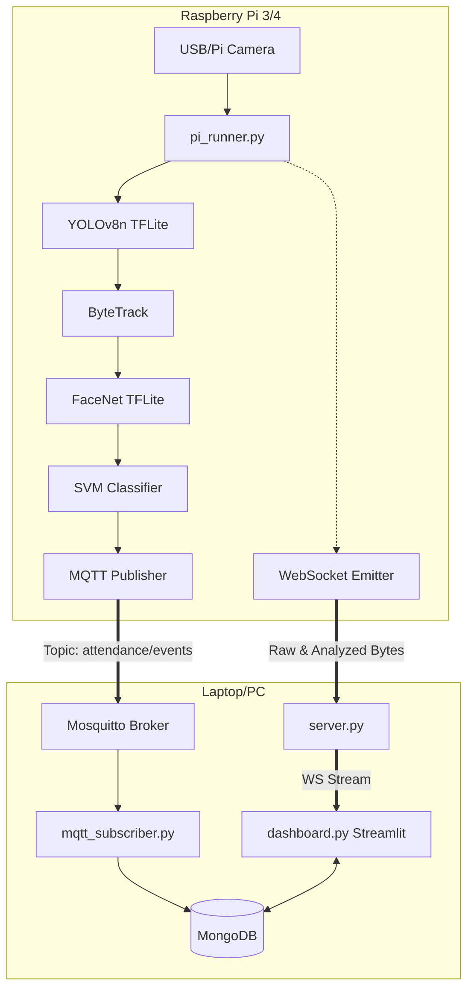
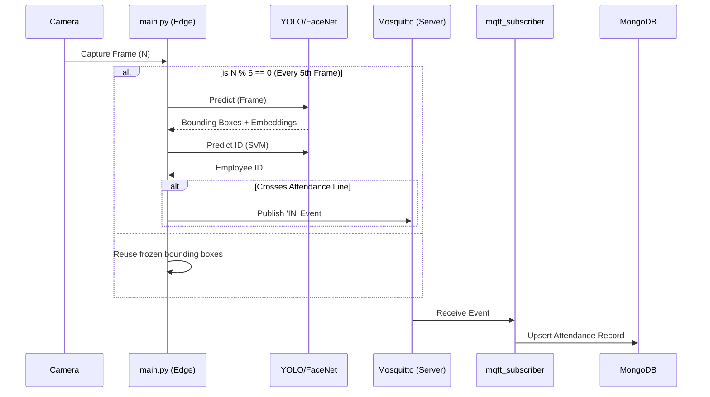

# System Architecture

## High-Level Architecture
The system is divided into two physical nodes:
1.  **Edge Node (Raspberry Pi):** Responsible for video capture, heavy AI inference (YOLO + FaceNet), and broadcasting events via MQTT.
2.  **Server Node (Laptop/PC):** Hosts the MongoDB database, Mosquitto MQTT Broker, FastAPI WebSocket Router, and the Streamlit Dashboard.

## Data Flow Diagram

## Repository Structure

*   `/facenet_files/`: Core recognition scripts (embedding extraction, SVM).
*   `/facenet_models/`: Pre-trained weights (`svm_classifier.pkl`).
*   `/yolo_models/`: YOLO TFLite models for face detection.
*   `config.py`: Centralized environment configurations.
*   `dashboard.py`: Streamlit frontend.
*   `db.py`: MongoDB CRUD wrappers.
*   `main.py`: Edge pipeline orchestrator.
*   `mqtt_publisher.py` / `mqtt_subscriber.py`: Pub/Sub logic.
*   `pi_runner.py`: Edge node entry point and camera loop.
*   `server.py`: FastAPI server for WS streams.
*   `training.py`: SVM training and Albumentations pipeline.
*   `yolo_tflite.py`: Custom zero-dependency YOLO TFLite wrapper.
