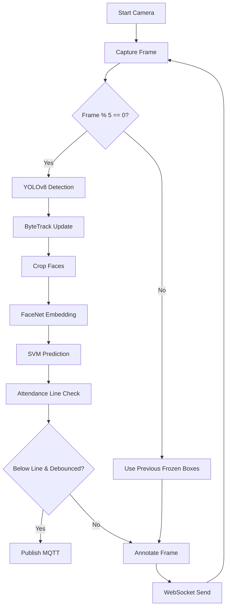

# Raspberry Pi Pipeline

The Edge Node acts as a lightweight, zero-dependency (no PyTorch) inference engine. 

## Flowchart

## Core Components
1.  **Camera Initialization:** Managed by OpenCV in `pi_runner.py`. Frames are captured at a target of 15 FPS.
2.  **Frame Skipping Logic:** Running YOLO and FaceNet on every frame causes thermal throttling and power spikes (undervoltage) on a Raspberry Pi. `main.py` explicitly skips the heavy AI pipeline for 4 out of 5 frames. During skipped frames, the previous tracker IDs and bounding boxes are visually frozen on the screen.
3.  **YOLO Detection:** `yolo_tflite.py` processes a 320x320 NHWC tensor. Custom math maps the 0.0-1.0 normalized coordinates back to pixel space, followed by `cv2.dnn.NMSBoxes`.
4.  **ByteTrack:** `supervision.ByteTrack` correlates YOLO boxes. Due to frame skipping, `minimum_consecutive_frames=1` is strictly enforced so tracks aren't dropped instantly.
5.  **FaceNet:** Cropped faces are resized to 160x160 and fed to `facenet.tflite` (FP16).
6.  **Data Transmission:** Processed frames are put into a `queue.Queue(maxsize=1)`. A background thread pops the latest frame and sends it over WebSockets. Size 1 ensures that network lag results in dropped frames, rather than accumulating memory and causing streaming delays.
