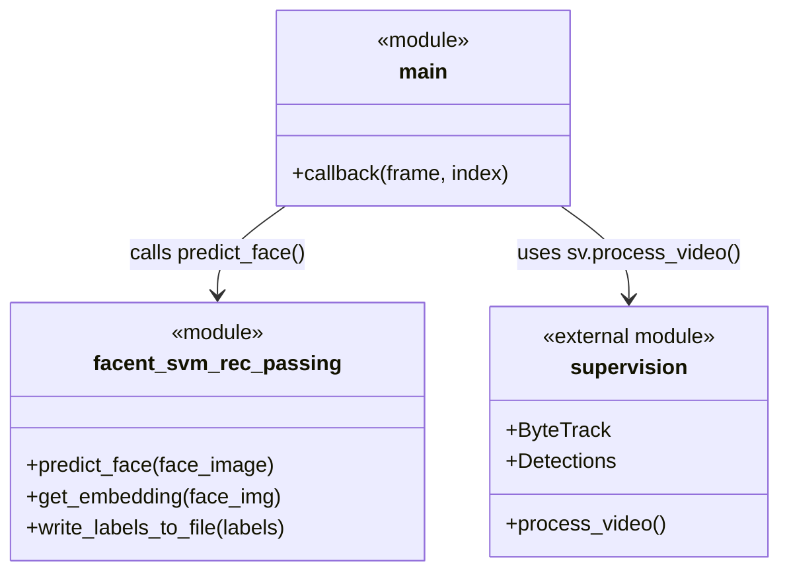

# 12. Class and Module Relationships

This project heavily favors a functional, script-based approach rather than Object-Oriented Programming (OOP). Most logic is contained in top-level functions.

## Important Classes

### Class: `FACELOADING`
**File:** `training.py`
**Purpose:** Automates the preprocessing of a dataset directory for training.
**Attributes:**
- `directory`: The path to the dataset.
- `target_size`: `(160, 160)` for FaceNet input.
- `X`, `Y`: Lists storing extracted faces and labels.
- `detector`: MTCNN instance.
**Methods:**
- `extract_face(filename)`: Reads an image, detects the face via MTCNN, crops and resizes it.
- `load_faces(dir)`: Iterates over a directory and calls `extract_face`.
- `load_classes()`: Main entry point that iterates over subdirectories (classes) and populates `X` and `Y`.
- `plot_images()`: Uses `matplotlib` to display the loaded dataset.
**Created By:** `training.py` at the module level.
**Used By:** Developer during model training.
**Depends On:** `mtcnn.MTCNN`, `cv2`, `os`, `matplotlib.pyplot`

## Module Relationships

- **`main.py`**: The orchestrator. Depends on everything.
- **`facent_svm_rec_passing.py`**: A service module. It abstracts away the complexity of the Keras FaceNet and Scikit-Learn SVM. It depends on `facenet_models/new_classifier_Jun27_759.pkl`.
